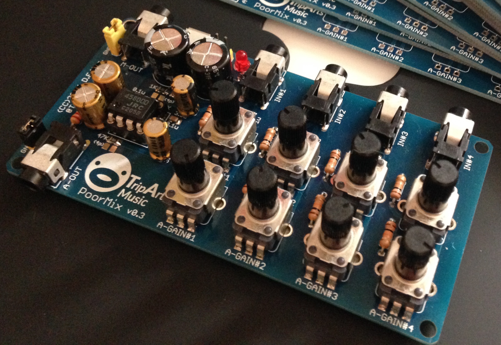
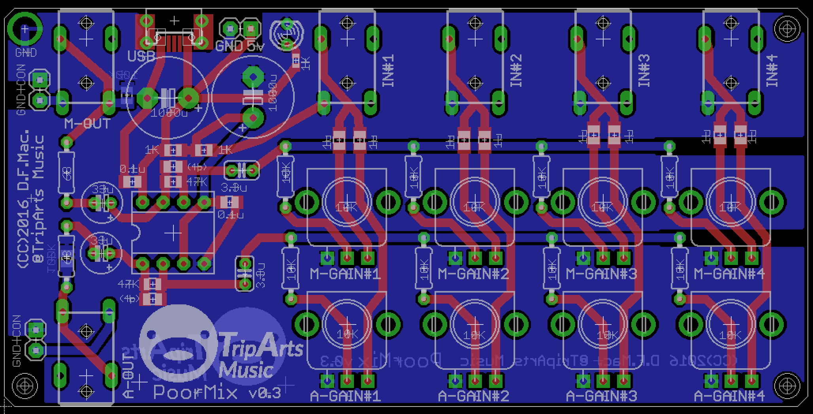
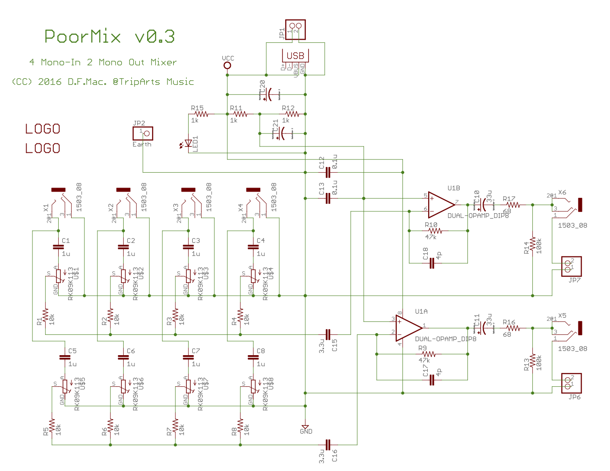

# poorMix

The `poorMix` is a four channel inputs and two channel outputs audio mixer.
Its open-source, simple, compact and easy to build!

# features

- 4 mono channel inputs (3.5mm stereo pin-jack, only use L channel to input)
- 2 mono channel outputs, it be able to use sound roopback (3.5mm stereo pin-jack) 
- 8 independently volume control knobs 
- DIP8 opamp (replaceable as you like)
- micro-B USB Power (5V only)

# board

# schematic

# parts list

- Capacitor 1000uF (Dia 10mm) * 2 (C20,C21)
- Capacitor 3.3〜10uF (Dia 3mm) * 2 (C15,C16)
- Capacitor 33〜47uF (Dia 4mm) * 2 (C10,C11)
- Capacitor 1uF (0805) * 8
- Capacitor 0.1uF (0805)  * 2
- Resister 100KΩ (0805) * 2
- Resister 47KΩ (0805) * 2
- Resister 1KΩ (0805) * 2
- Resister 1KΩ (0603) * 1
- Resister 68Ω (1/2W Lead) * 2
- Resister 4.7K〜10KΩ (1/4W Lead) * 8
- LED 3mm * 1
- 3.5mm Pin Jack([MX387GL](http://www.marutsu.co.jp/pc/i/36004/)) * 6
- micro USB Connector ([SUMAI-05](https://ja.aliexpress.com/item/Free-shipping-100pcs-lot-4-feet-DIP-5P-SMD-Micro-USB-Connector-V8-Port-Charge-Socket/32214653369.html?spm=2114.13010608.0.0.Jl93ED)) * 1
- Potentiometer [RK09K1130A5R](http://www.alps.com/prod/info/J/HTML/Potentiometer/RotaryPotentiometers/RK09K/RK09K1130A5R.html) * 8
- Pin Header (1*2) * 3
- [Jumper Pin](http://akizukidenshi.com/catalog/g/gP-03688/) * 2
- [Dip 8 IC Socket](http://akizukidenshi.com/catalog/g/gP-00035/) * 1
- OPAMP ([NJM4580DD](http://akizukidenshi.com/catalog/g/gI-00069/)) * 1

# licenses

- [CC-BY 4.0 (Creative Commons Attribution 4.0 International)](https://creativecommons.org/licenses/by/4.0/legalcode)
